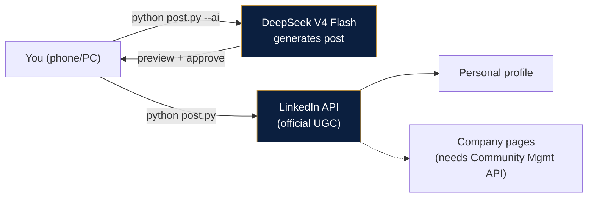

# LinkedIn Autopilot 🔥

**AI writes. You approve. It posts.**

A local-first LinkedIn posting tool that pairs **DeepSeek content generation** with the **official LinkedIn API** — no SaaS fees, no dashboards, no Replit session headaches. Your posts, on autopilot.


## Why this exists

Most "LinkedIn automation" guides end in a rabbit hole: OAuth scopes, disabled API products, Replit sessions that sleep, tokens that expire mid-demo. This repo is the opposite — **two boring Python files, zero dependencies, works every time**. The story of this tool is literally the journey: scope errors, disabled products, expired auth codes. All solved, all documented below.

## How it works



## Features

- **🤖 AI content engine** — DeepSeek writes engagement-ready posts (hook → value → CTA → hashtags), in English or Arabic
- **✍️ Manual mode** — write it yourself, script just publishes
- **👤 Personal + 🏢 Pages** — post to your profile or company pages you admin
- **🔐 Token auto-refresh** — long-lived session, no re-login every time
- **📦 Zero dependencies** — Python standard library only. No pip installs, no npm, no node_modules
- **💸 Free forever** — LinkedIn API + DeepSeek pennies + your own machine

## Quick start (10 minutes)

```bash
# 1. Get a LinkedIn Developer App
#    developer.linkedin.com → Create app → add "Share on LinkedIn"
#    Redirect URL: http://localhost:8787/callback

# 2. Configure
cp .env.example .env        # add LINKEDIN_CLIENT_ID, LINKEDIN_CLIENT_SECRET, DEEPSEEK_API_KEY

# 3. Authorize once
python auth.py              # browser opens → click Allow → token saved

# 4. Post!
python post.py --personal "Hello LinkedIn! 👋"
```

## Usage

```bash
# Manual text → personal profile
python post.py --personal "Your post text here"

# AI-generated → personal profile (topic optional)
python post.py --ai --personal --topic "facility management trends KSA"

# Manual text → company page
python post.py --page --page-name ifmi "Your post text"

# AI-generated → company page
python post.py --ai --page --page-name luxewave
```

## Company pages — one-time setup

Posting to **company pages** requires the **Community Management API** product on your LinkedIn app (scopes: `w_organization_social`). It's self-serve on most accounts; if the request button is disabled, verify your phone number and retry. Add your page URNs to the `PAGES` dict in `post.py`:

```python
PAGES = {
    "luxewave": "urn:li:organization:115792525",
    "ifmi": "urn:li:organization:108790715",
}
```

## Token lifecycle

- Access tokens last **~60 days**, then re-run `python auth.py` (one click)
- Token stored in `token.json` (git-ignored) — revoke anytime in LinkedIn settings

## Security

- `.env` + `token.json` are **git-ignored** — never commit credentials
- Client secret stays on your machine; only the auth code flows through the browser
- No third-party servers; your posts go straight from your machine to LinkedIn

## License

MIT — use it, fork it, ship it.
